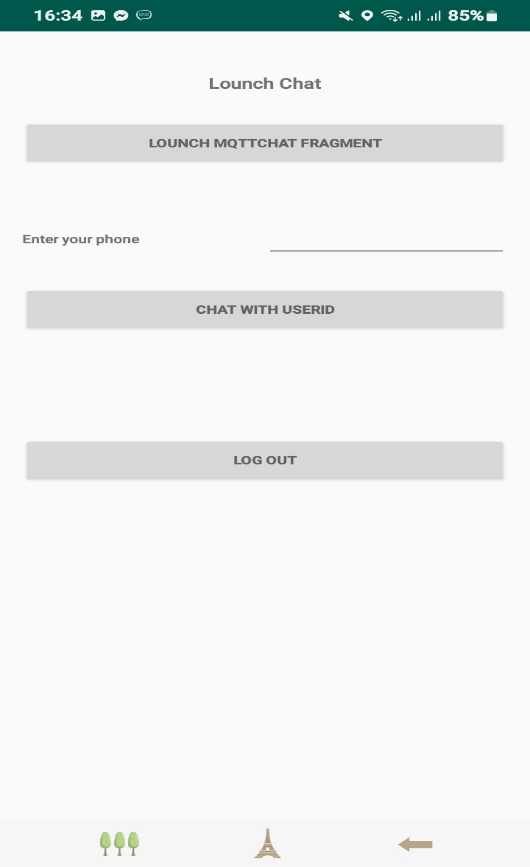
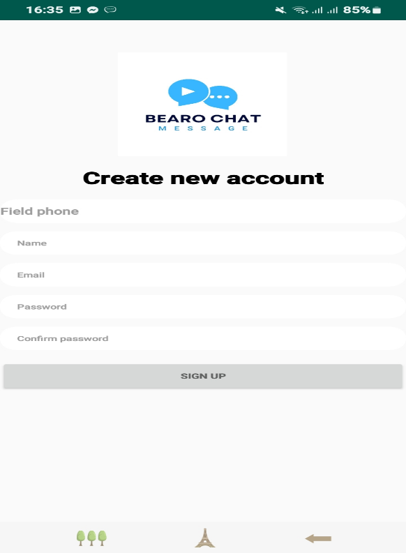
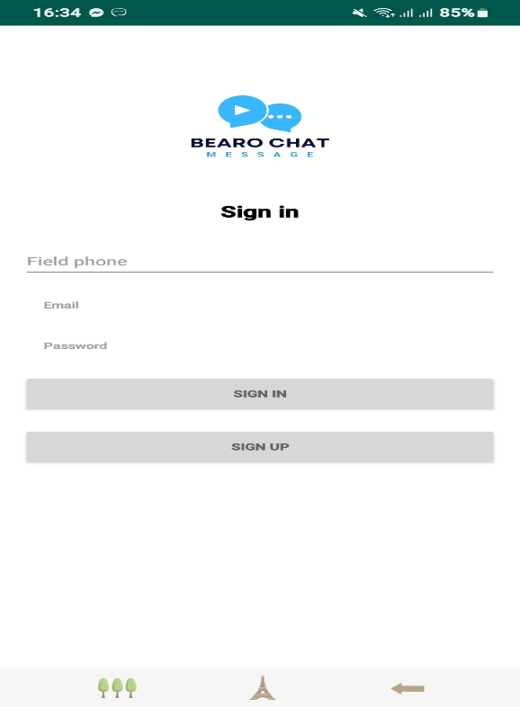
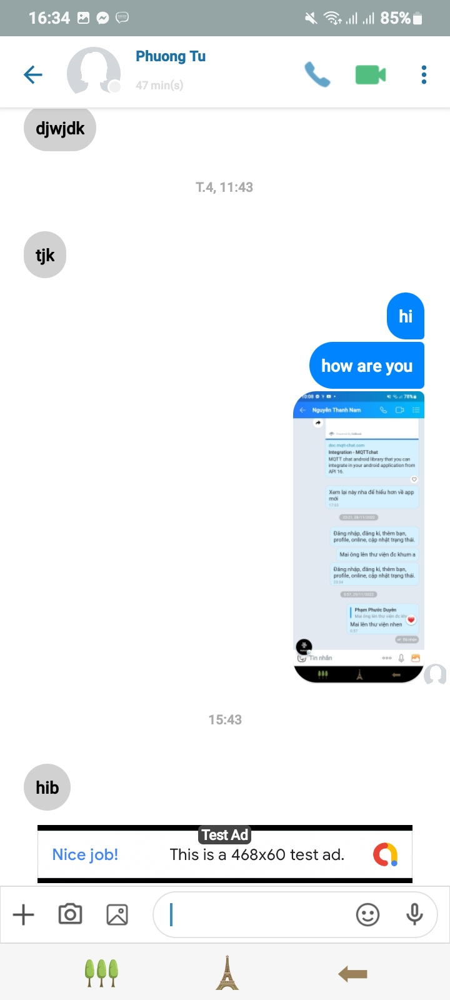
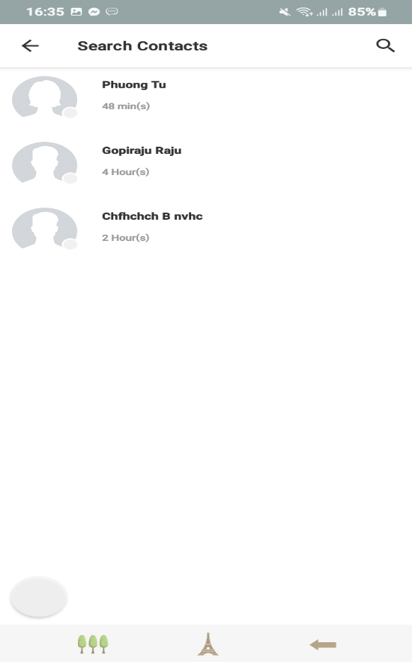
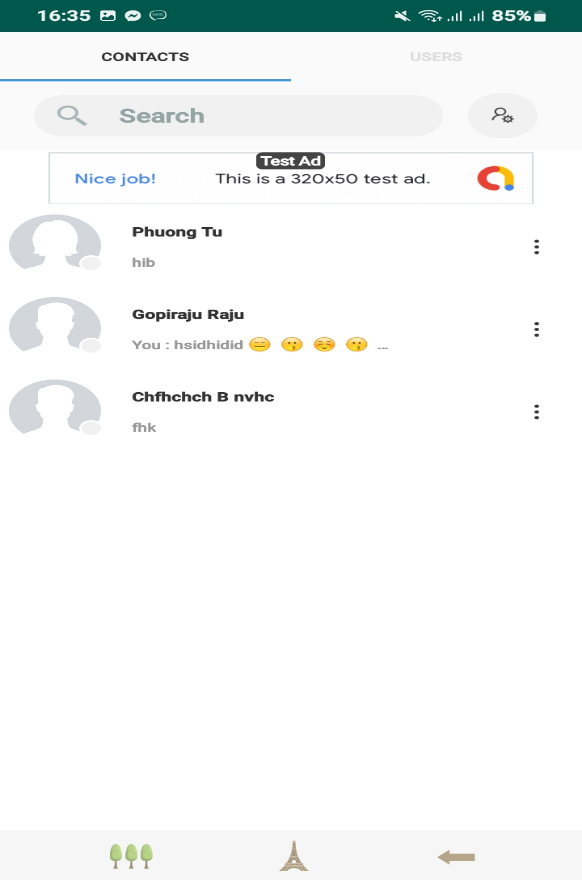
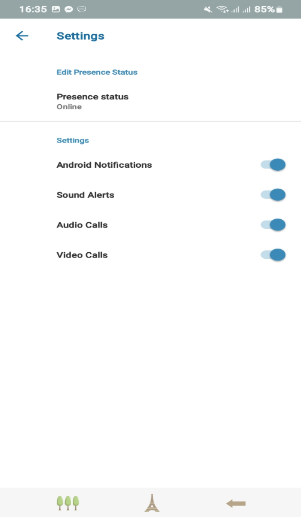
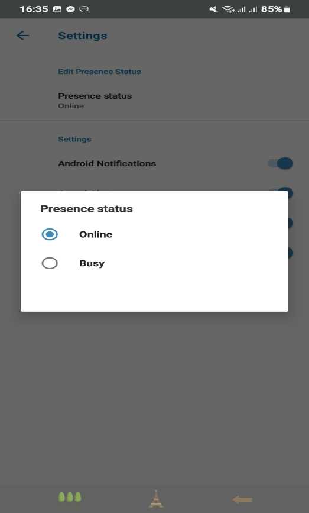

 <h1 align="center">CHAT APP BEARO</h1>

## ⭐ Introduction

Purpose of this document is to fully and comprehensively describe the requirements of a chat software that allows users to communicate with each other. It clarifies the actors who interact with the system, the data constraints, and supports easier code writing, helping the development team to accurately build the system and specify its features. Additionally, this document assists in maintaining the system and improving its functions quickly and easily.
##  🤝 Experiments
### 1. Onboarding, Sign up & Sign in

|            Chat Screen            |           Sign Up Screen            |              Sign in Screen               |
| :-------------------------------: | :--------------------------------------: | :--------------------------------------: |
|  |  |  |

### 2. Search

### 3. Chat

|            Chat Screen            |            Search Screen            |             More Screen               |
| :-------------------------------: | :--------------------------------------: | :--------------------------------------: |
|        |        |        |

### 4. Profile

|            Screen 1             |           Screen 2            |
| :----------------------------------: | :--------------------------------: |
|          |        |

## ⭐ Future Features

-   Pending

_Feel free to fork and contribute to include these features._ ❤︎

## 🚀 Technologies

 Programming tools and languages used:
  -   Database management system: Firebase.
  -   Programming tools: Android Studio,.
  -   Programming language: Kotlin.

## 🤝 Contribute

To contribute, fork the repository and push the changes to the **master** branch. Then submit a pull request for merging with the source. If your code passes the review and checks it will be merged into the master branch.

## 💬 Feedback

Feel free to send us feedback on [Gmail] Feature requests are always welcome.

## 📝 License

Licensed under the [MIT License].
